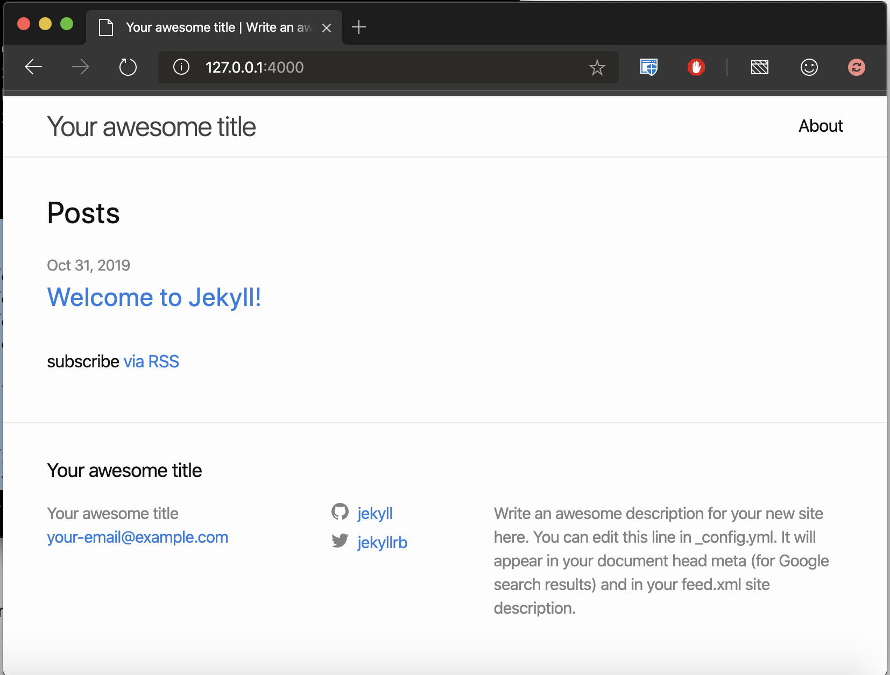

I had been wanting to start my own blog for quite sometime, well actually long time. I am happy that it has finally come alive. While looking into the details on how to host my own blog, I came across several ways (Blogger, Medium, WordPress, Github Pages etc.) to do that. I have absolultely no experience in web development and hosting. I didn't know a thing about Jekyll, Ruby, Flask, WordPress etc. I wanted a platform that is simple to maintain and allows writing in plain text as much as possible. Github Pages perfectly fitted my needs. I looked into the some of tutorials and blog posts online to get familiar with the basics of Github Pages. There is definitely a bit of learning curve, but that kick of learning something totally new pulled me towards Github Pages even harder.

## Why Github Pages

I chose Github Pages for the following reasons:

- With Github and Jekyll, I can write in Markdown and let Jekyll take care of rendering my markdown in a beautiful way. I started using Markdown for my personal notes couple years ago and never looked back. It is the best distraction free format to write.
- Excellent community support from Github Pages, Jekyll, Jekyll themes, Stack Overflow
- Version control
- All the contents of my blog are going to be static content anyway. So I don't need an expensive hosting service. Github Pages is free.

## Getting Started

Github Pages comes in two variants:

- User pages - one per user account, available at `https://username.github.io`, published from the master branch of `username.github.io` repository
- Project pages - available for every project under a user or organization, available at `https://username.github.io/repository`, typically published from `gh-pages` branch of the project repository (but the branch can be configured)

A super simple user page can be set up even under two minutes. See instructions [here](https://pages.github.com/). For this post, I'll be focusing on setting up a static website with Jekyll locally and then hosting it in my Github user page. I'm a Mac user, so the instructions here are going to be specific to macOS. They worked good on macOS Catalina, so I expect to work in the few older releases as well. If you find something not working, let me know.

## Setting up the environment

I started from [this](https://help.github.com/en/github/working-with-github-pages/creating-a-github-pages-site-with-jekyll) and [this](https://help.github.com/en/github/working-with-github-pages/testing-your-github-pages-site-locally-with-jekyll) help pages. The following tools and packages must be installed before creating a Jekyll site.

- Git - for version control
- [Ruby](https://en.wikipedia.org/wiki/Ruby_\(programming_language\)) - Peek [here](https://learnxinyminutes.com/docs/ruby/) for a quick tutorial on Ruby and [here](https://jekyllrb.com/docs/ruby-101/) for a quick overview of the Ruby Gems used here. Jekyll itself is a ruby gem, so we can't run without Ruby.
- [Ruby Gems](https://en.wikipedia.org/wiki/RubyGems) - Gems are nothing but packages in Ruby, [managed](https://guides.rubygems.org/what-is-a-gem/) through Ruby Gems.
  - [Jekyll](https://jekyllrb.com/docs/) - the static site generator
  - [Bundler](https://jekyllrb.com/tutorials/using-jekyll-with-bundler/) - dependency manager for ruby gems

I had already installed git in my machine and vaguely remember macOS comes with ruby installed too. I checked my installation and found them already installed. Whoohoo! That was quick..I can directly install Jekyll and get started with blog. But things didn't turn out that way.

```text
$ ruby -v
ruby 2.6.3p62 (2019-04-16 revision 67580) [universal.x86_64-darwin19]
$ gem -v
3.0.3
$ bundle -v
Bundler version 1.17.2

$ which ruby
/usr/bin/ruby
$ which gem
/usr/bin/gem
$ which bundle
/usr/bin/bundle
```

It is strictly not recommended to use the system versions of Ruby as it is also used by macOS for various purposes. If something goes wrong and we have to reinstall ruby or we have to change the ruby version for any reason, then we will be in trouble. So it best not disturb the system installation of Ruby.

I then followed the instructions from Jekyll [installation page](https://jekyllrb.com/docs/installation/macos/) and installed the following in my machine.

- [rbenv](https://github.com/rbenv/rbenv) - Ruby version management tool. Similar to another ruby version management tool [RVM](https://rvm.io/rvm/basics), but it is lighter. If you have already installed RVM, see this [medium post](https://medium.com/@namangupta01/replacing-rvm-with-rbenv-in-os-x-9dea622bd639) for instructions to replace RVM with rbenv.
- ruby 2.6.3
- bundler and jekyll ruby gems

```text
$ which ruby
/Users/deepan/.rbenv/shims/ruby
$ which gem
/Users/deepan/.rbenv/shims/gem
$ which jekyll
/Users/deepan/.gem/ruby/2.6.0/bin/jekyll
$ jekyll -v
jekyll 4.0.0
$ which bundle
/Users/deepan/.gem/ruby/2.6.0/bin/bundle
$ gem list jekyll

*** LOCAL GEMS ***

jekyll (4.0.0)

$ gem list bundle

*** LOCAL GEMS ***

bundler (2.0.2, default: 1.17.2)
```

Explore the `--help` message of the above commands to find out the various options available.

## Creating a site locally

Once all the required tools are installed, we can set up a Jekyll site with just couple of commands.

Run `jekyll new <folder-name>`. Jekyll will create a folder with bunch of files needed to host the site. Use `--force` flag to overwrite an existing folder.

```text
$ jekyll help new
jekyll new -- Creates a new Jekyll site scaffold in PATH

Usage:

  jekyll new PATH

$ jekyll new awesome_blog
Running bundle install in /Users/deepan/sandbox/awesome_blog...
  Bundler: Fetching gem metadata from https://rubygems.org/...........
  Bundler: Fetching gem metadata from https://rubygems.org/.
  Bundler: Resolving dependencies...
  Bundler: Using public_suffix 4.0.1
  Bundler: Using addressable 2.7.0
  Bundler: Using bundler 2.0.2
  Bundler: Using colorator 1.1.0
  Bundler: Using concurrent-ruby 1.1.5
  Bundler: Using eventmachine 1.2.7
  Bundler: Using http_parser.rb 0.6.0
  Bundler: Using em-websocket 0.5.1
  Bundler: Using ffi 1.11.1
  Bundler: Using forwardable-extended 2.6.0
  Bundler: Using i18n 1.7.0
  Bundler: Using sassc 2.2.1
  Bundler: Using jekyll-sass-converter 2.0.1
  Bundler: Using rb-fsevent 0.10.3
  Bundler: Using rb-inotify 0.10.0
  Bundler: Using listen 3.2.0
  Bundler: Using jekyll-watch 2.2.1
  Bundler: Using kramdown 2.1.0
  Bundler: Using kramdown-parser-gfm 1.1.0
  Bundler: Using liquid 4.0.3
  Bundler: Using mercenary 0.3.6
  Bundler: Using pathutil 0.16.2
  Bundler: Using rouge 3.12.0
  Bundler: Using safe_yaml 1.0.5
  Bundler: Using unicode-display_width 1.6.0
  Bundler: Using terminal-table 1.8.0
  Bundler: Using jekyll 4.0.0
  Bundler: Using jekyll-feed 0.12.1
  Bundler: Using jekyll-seo-tag 2.6.1
  Bundler: Using minima 2.5.1
  Bundler: Bundle complete! 6 Gemfile dependencies, 30 gems now installed.
  Bundler: Use `bundle info [gemname]` to see where a bundled gem is installed.
New jekyll site installed in /Users/deepan/sandbox/awesome_blog.
```

Now that we have created the files, lets serve them with `jekyll serve`. Run this command under the context of `bundle exec`. Bundle reads the `Gemfile` in the current folder and installs the specified gems and their dependencies to be available for the given command. In this case, our static site requires the gems `jekyll`, `minima`, `jekyll-feed` and some more. Each of these gems may have additional dependencies on their own. Bundle takes care of installing any depedent gems as well. That is why it is recommended to run jekyll with bundle.

```text
$ cd awesome_blog/
$ bundle exec jekyll serve
Configuration file: /Users/deepan/sandbox/awesome_blog/_config.yml
            Source: /Users/deepan/sandbox/awesome_blog
       Destination: /Users/deepan/sandbox/awesome_blog/_site
 Incremental build: disabled. Enable with --incremental
      Generating...
       Jekyll Feed: Generating feed for posts
                    done in 0.592 seconds.
 Auto-regeneration: enabled for '/Users/deepan/sandbox/awesome_blog'
    Server address: http://127.0.0.1:4000/
  Server running... press ctrl-c to stop.
```

Output `bundle exec jekyll serve` command lists the port on which the web server is running. The default port is `4000`. Go to `http://127.0.0.1:4000/` on your favorite browser.
We will see a page like this.


This is the default home page of template site created by Jekyll.

## Under the hood

What are the files in the website created by jekyll?

```text
$ ls | nl
     1  404.html
     2  Gemfile
     3  Gemfile.lock
     4  _config.yml
     5  _posts
     6  _site
     7  about.markdown
     8  index.markdown
```

- `404.html` contains the text to be displayed when we run into [HTTP 404](https://en.wikipedia.org/wiki/HTTP_404) error.
- `Gemfile` lists the gem dependencies to run the website. Open the file in your favorite editor and take a look. I use vim when working with remote machines and VS Code when working on local machine. VS Code is highly customizable. It has excellent support for most languages and numerous extensions from great developers. The extensions [Markdown all in one](https://marketplace.visualstudio.com/items?itemName=yzhang.markdown-all-in-one) and [markdown lint](https://marketplace.visualstudio.com/items?itemName=DavidAnson.vscode-markdownlint) greatly augment VS Code's native support for markdown.

Here is the Gemfile (excluding comments). The first line `source "https://rubygems.org` in the file tells us where to find the specified gems. The following lines list the depedent gems along with their minimum supported versions. `minima` is the gem for the default theme of the same name `minima`, used by Jekyll. More on themes later.

```shell
$ grep -v '^#' Gemfile
source "https://rubygems.org"
gem "jekyll", "~> 4.0.0"
gem "minima", "~> 2.5"
group :jekyll_plugins do
  gem "jekyll-feed", "~> 0.12"
end

install_if -> { RUBY_PLATFORM =~ %r!mingw|mswin|java! } do
  gem "tzinfo", "~> 1.2"
  gem "tzinfo-data"
end

gem "wdm", "~> 0.1.1", :install_if => Gem.win_platform?
```

- `Gemfile.lock` is a snapshot of all the gems installed when bundler ran last time. This file lists the sub dependencies as well. For e.g. `jekyll 4.0.0` depends on multiple gems. This snapshot helps in making sure that all third party dependencies are properly satisfied when we build the site. Note that we can require a gem to be at a specific version or a range of versions too.

```text
    jekyll (4.0.0)
      addressable (~> 2.4)
      colorator (~> 1.0)
      em-websocket (~> 0.5)
      i18n (>= 0.9.5, < 2)
      jekyll-sass-converter (~> 2.0)
      jekyll-watch (~> 2.0)
      kramdown (~> 2.1)
      kramdown-parser-gfm (~> 1.0)
      liquid (~> 4.0)
      mercenary (~> 0.3.3)
      pathutil (~> 0.9)
      rouge (~> 3.0)
      safe_yaml (~> 1.0)
      terminal-table (~> 1.8)
```

- `_config.yml` contains the top level settings such as `title`, `email`, `theme` etc. that are typically static and applicable for the entire site. Variables defined here can be accessed in other html files using `{{ site.variable }}`. You can also see that site theme is set to `minima` in this file. If you are fairly new YAML like me, then [learnxinyminutes page](https://learnxinyminutes.com/docs/yaml/) is a great place to start to get a quick overview of YAML syntax and specifications. Check out the docs for other languages too. When using github-pages, we can use themes hosted on github repos using the `remote_theme` setting. More on this in a later post.

```yaml
# Build settings
theme: minima
```

- `_posts` folder is the heart of our site. Each file in this folder corresponds to a post. Jekyll requires the files to strictly follow the convention **yyyy-mm-dd-title-of-the-post**. File type must be markdown or HTML. The default site created by Jekyll comes with a single post in markdown format. Lets see what is in side.

```shell
$ ls _posts/
2019-10-31-welcome-to-jekyll.markdown
```

Here are first 10 lines from the file `2019-10-31-welcome-to-jekyll.markdown`. Each post in the `_posts` folder typically begins with some content in yaml guarded by triple dashes `---`. It is called the [front matter](https://jekyllrb.com/docs/front-matter/). This section sets the values for predefined variables such as *layout* and *permalink* and also allows us to define our own variables. These values can then be accessed in the layouts or includes where this post is processed. 

```markdown
---
layout: post
title:  "Welcome to Jekyll!"
date:   2019-10-31 00:08:09 -0400
categories: jekyll update
---
You’ll find this post in your `_posts` directory. Go ahead and edit it and re-build the site to see your changes. You can rebuild the site in many different ways, but the most common way is to run `jekyll serve`, which launches a web server and auto-regenerates your site when a file is updated.

Jekyll requires blog post files to be named according to the following format:
`YEAR-MONTH-DAY-title.MARKUP`
```

For e.g.

- `categories: jekyll update` tells Jekyll to group this post under the categories `jekyll` and `update`.
- `layout: post` tells Jekyll to apply the post layout to this file. What is this post layout? Remember, the default site comes with `minima` theme. The layout is defined in our theme folder. See below on how to locate the layout files. Other layouts in the minima theme are `page` - applied to pages containing group of posts, `home` - applied to home page. You can see that `index.markdown` uses the `home` theme.

```shell
$ cd $(bundle show minima)
$ ls
LICENSE.txt _includes _sass
README.md _layouts assets
$ cd _layouts/
$ ls
default.html home.html page.html post.html
```

- `_site` contains the files generated by Jekyll after processing our site. Any change to our content files (index.md, posts etc) will require files in `_site` to be regenerated. Github Pages builds the site after each commit to the master branch of the pages repo. So we don't have to include the _site folder in our repo. Make sure `_site` is included in the `.gitignore` file when creating the git repo.
- `about.markdown` - contents to show in the about page of the site.
- `index.markdown` - contents to show in the index page of the site.

## Summary

We covered the following topics in this post:

- Advantages of Github Pages
- Setting up Jekyll and related tools (ruby, rbenv, bundle) on macOS
- Commands to generate a static site with Jekyll
- Contents of the default site generated by Jekyll.
- Along the process, we also discussed the themes, layouts, config, Gemfile, gem dependencies.
- Managing posts in `_posts` directory of the site

The steps covered here is just one among the many ways to set up Github Pages. There are ways to set up a Github Page completly online without any local operations. I will cover that in a later post.

This blog is an extension of my learning journey. When learning something new, I often take notes so that I can revisit later in case I need to refer. I post them here, so others can also benefit from my experience.

## Tip time

I have been learning about Linux internals in my spare time off late. I'm more of a keyboard person than mouse in my regular work. So I focused on exploring the various CLI commands, their options, and general scripting in Linux. That helped to be more productive than ever before. I'll be sprinkling my posts with at least one tip related to Linux conmand line tools.

`ls` command lists one entry per line by default if the output is not a terminal.

Default output of `ls` command
```shell
$ ls
Gemfile    README.md  _data    _posts    assets
Gemfile.lock  _config.yml  _pages    _site    index.html
```

When piping the output to another command (`nl` here), it writes one entry per line.

```shell
$ ls | nl
     1  Gemfile
     2  Gemfile.lock
     3  README.md
     4  _config.yml
     5  _data
     6  _pages
     7  _posts
     8  _site
     9  assets
    10  index.html
```

Similarly, `ls` sends one entry per line when redirectin to a file as well.

```shell
$ ls > files_under_jekyll_site
$ cat files_under_jekyll_site
Gemfile
Gemfile.lock
README.md
_config.yml
_data
_pages
_posts
_site
assets
files_under_jekyll_site
index.html
```

To force `ls` to show one entry per line, use `ls -1`.

```shell
$ ls -1
Gemfile
Gemfile.lock
README.md
_config.yml
_data
_pages
_posts
_site
assets
files_under_jekyll_site
index.html
```

## References

- [Github Pages with Jekyll](https://help.github.com/en/github/working-with-github-pages/setting-up-a-github-pages-site-with-jekyll)
- [Testing with Jekyll locally](https://help.github.com/en/github/working-with-github-pages/testing-your-github-pages-site-locally-with-jekyll)
- [Jekyll Installation](https://jekyllrb.com/docs/installation/)
- [Jekyll directory structure](https://jekyllrb.com/docs/structure/)
- [Learn YAML](https://learnxinyminutes.com/docs/yaml/)
- [ls man page](http://man7.org/linux/man-pages/man1/ls.1.html)

## todo

- [x] finish my first post
- [ ] update About page
- [ ] update categories, posts
- [ ] update bio
- [ ] pick a title